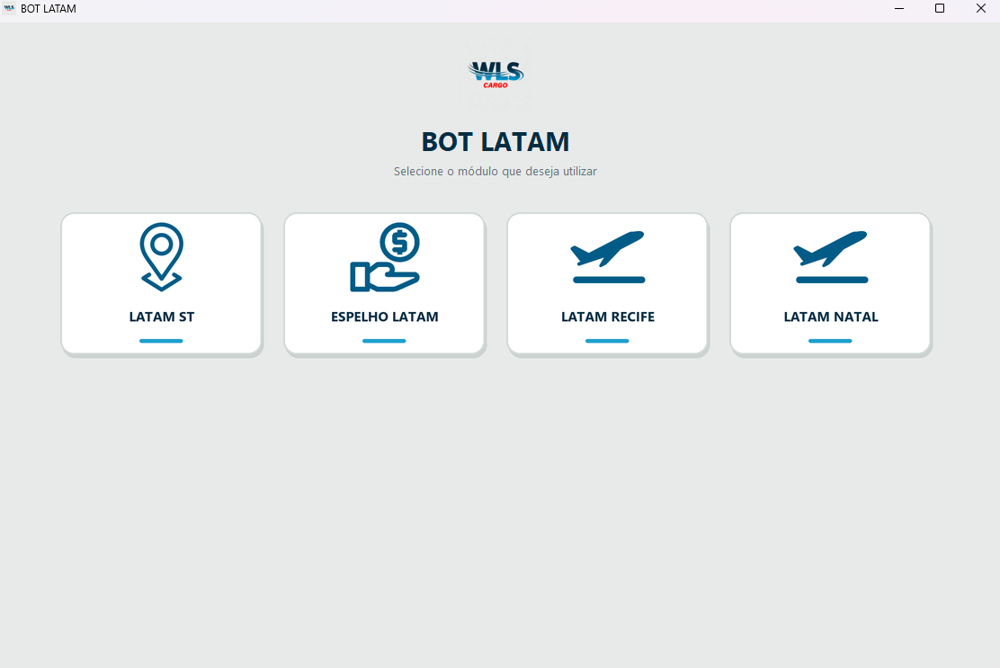
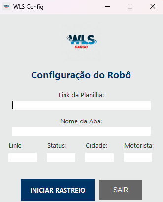
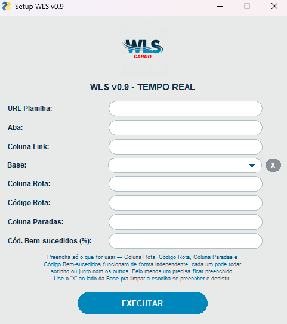
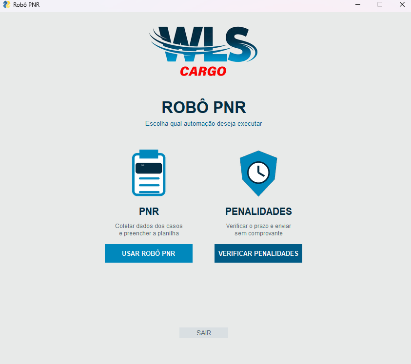
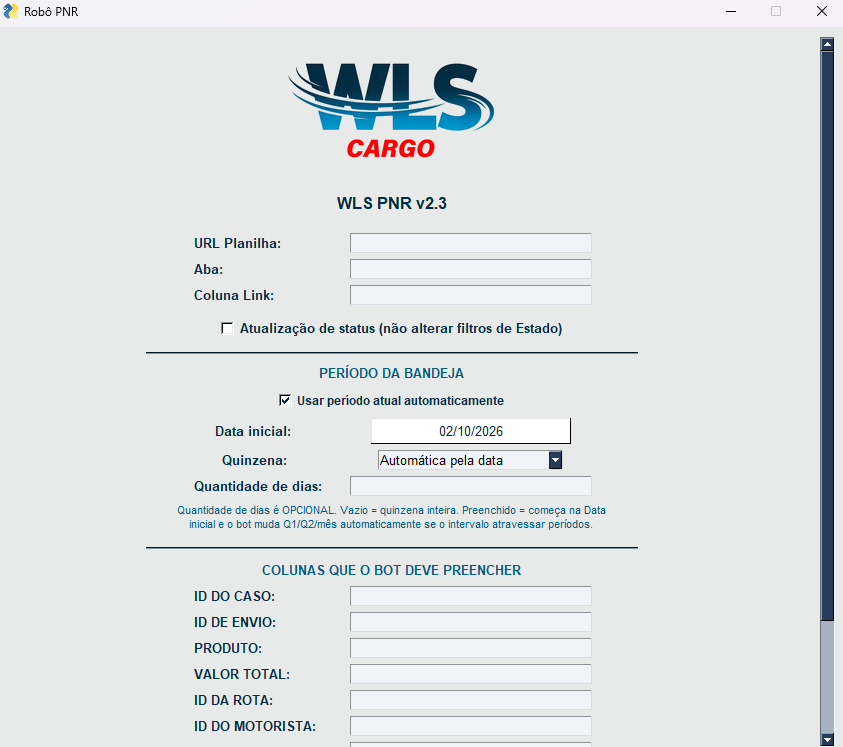
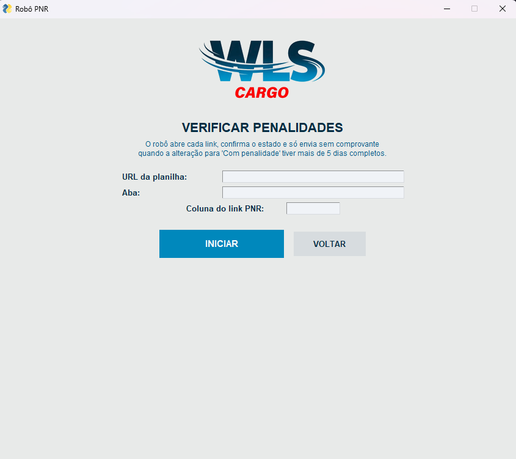

# Gabryel Santana

**Bacharel em Ciência da Computação | Desenvolvimento • Automação • Integrações**

Recife/PE  
[LinkedIn](https://www.linkedin.com/in/gabryel-santana-64a981230) • [E-mail](mailto:gabryelsantanaa03@gmail.com)

---

## Sobre mim

Sou formado em **Ciência da Computação pela UNINASSAU**, com conhecimentos e experiência prática em desenvolvimento de automações, aplicações web, integração entre sistemas e tratamento de dados.

Tenho familiaridade com **Python, JavaScript, SQL, HTML, APIs REST, Selenium, Git, GitHub e Google Sheets**, além de experiência prática com diagnóstico de falhas, troubleshooting e melhoria de processos.

Este repositório apresenta uma seleção de projetos e interfaces desenvolvidos por mim. Por segurança e confidencialidade, os códigos-fonte completos de algumas soluções permanecem privados.

## Tecnologias

`Python` • `JavaScript` • `SQL` • `HTML` • `APIs REST` • `Selenium` • `Git` • `GitHub` • `Google Sheets` • `Windows`

---

# Projetos em destaque

## 1. Automação de Operações Logísticas

Solução desktop criada para centralizar diferentes rotinas de automação em uma única interface, facilitando a execução de processos e reduzindo atividades manuais.

**Principais competências demonstradas:** Python, automação web, interface gráfica, organização modular e integração com planilhas.

  

[Detalhes do projeto](projects/automacao-operacoes-logisticas.md)

---

## 2. Automação de Acompanhamento de Status

Ferramenta voltada à consulta e acompanhamento automatizado de informações, com configuração de planilha, aba e campos que devem ser atualizados.

**Principais competências demonstradas:** Python, Selenium, Google Sheets, validação de dados e tratamento de erros.

  

[Detalhes do projeto](projects/automacao-status.md)

---

## 3. Automação de Rotas

Aplicação desenvolvida para executar rotinas automatizadas relacionadas a rotas, permitindo parametrização de campos, base e informações que serão processadas.

**Principais competências demonstradas:** Python, Selenium, processamento de dados, parametrização e automação de processos.

  

[Detalhes do projeto](projects/automacao-rotas.md)

---

## 4. Automação de Casos, Prazos e Validações

Solução com múltiplos módulos para coleta de informações, preenchimento automatizado de planilhas, configuração de períodos e verificação de prazos e pendências.

**Principais competências demonstradas:** Python, Selenium, automação web, tratamento de múltiplas páginas, validações, Google Sheets e troubleshooting.

  

  
  

[Detalhes do projeto](projects/automacao-casos.md)

---

## Formação acadêmica

**Bacharelado em Ciência da Computação**  
Centro Universitário Maurício de Nassau — **UNINASSAU**

## Formação complementar

**Fundação Bradesco**
- Linguagem de Programação Python — 53 horas
- Linguagem de Programação Python — Básico
- Banco de Dados — 38 horas
- Administrando Banco de Dados
- Introdução à Programação Orientada a Objetos (POO)

**DIO**
- Introdução à Lógica de Programação e Pensamento Computacional
- Introdução à Programação e Pensamento Computacional
- Introdução ao .NET
- Fundamentos de C# — sintaxe, tipos de dados, operadores e estruturas de repetição

## Idiomas

- **Português:** nativo
- **Espanhol:** avançado
- **Inglês:** básico, com leitura e compreensão de documentação técnica

---

## Código-fonte e propriedade intelectual

Este é um **portfólio demonstrativo**. Alguns projetos envolvem integrações, regras de negócio e informações que não devem ser expostas publicamente; por isso, seus códigos completos são mantidos em repositórios privados.

Os materiais deste repositório não são publicados sob licença open source. A disponibilização pública tem finalidade de apresentação profissional e não concede autorização para reutilização, redistribuição ou comercialização do conteúdo.

© 2026 Gabryel Santana.
